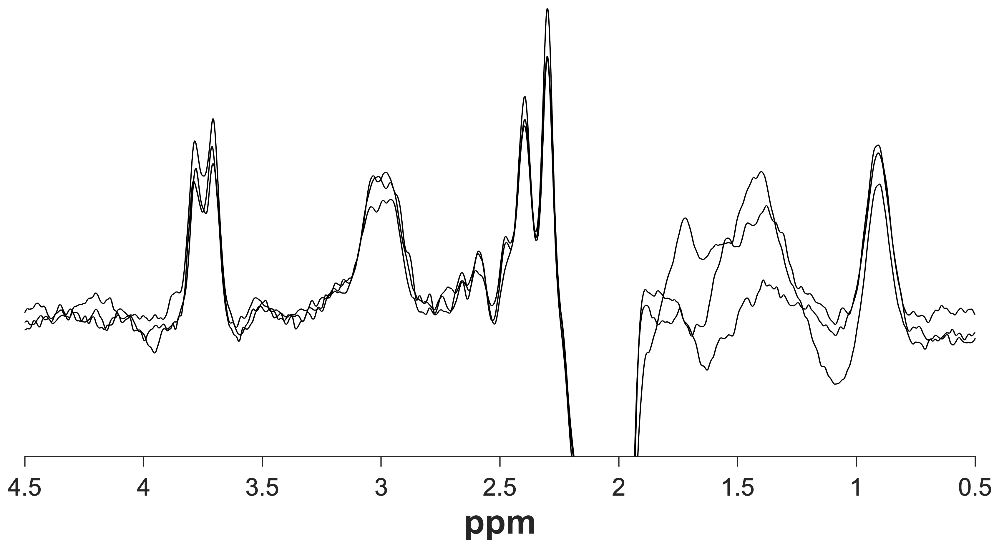
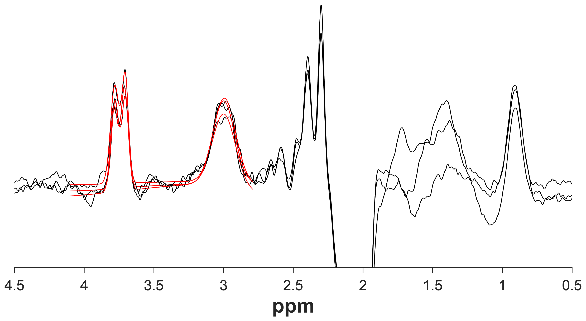
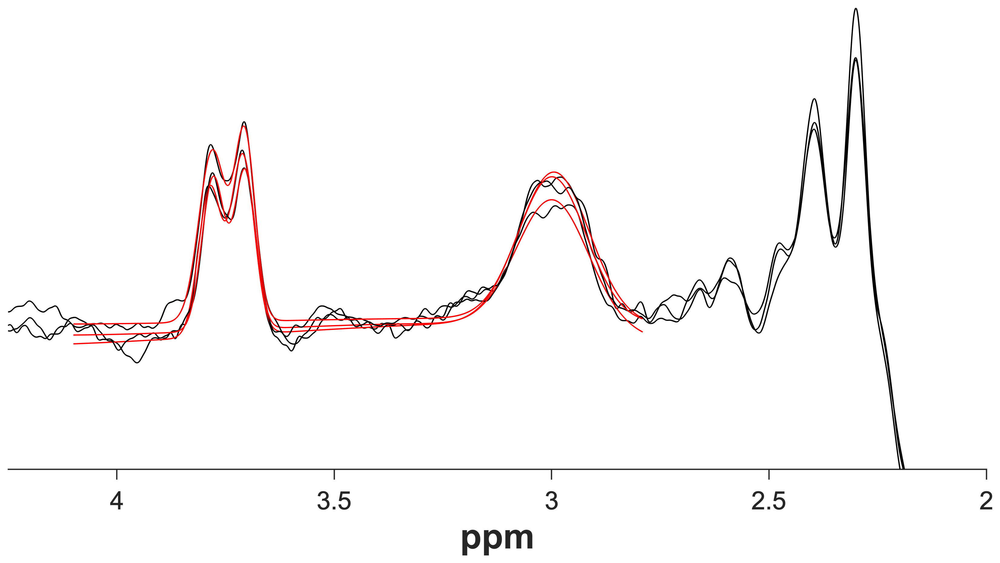

<style>
body .main-container {
  max-width: 1200px;
}
</style>

```{r setup, include = FALSE}
knitr::opts_chunk$set(echo = TRUE)
```

```{r, child = "js/back-to-top.js"}
```

<br>

In addition to the five core modules, Gannet comes with a few additional tools that you may find useful.

## PaperPlot

`PaperPlot.m` will plot the difference spectra saved in the Gannet output structure. The corresponding model fits optionally can also be plotted. Users can choose to plot a single spectrum, a select number of spectra, or all spectra. Multiple spectra will be overlaid in the same figure. If data were acquired with HERMES, then each Hadamard-combined difference spectrum will be plotted in a separate subplot.

Type `help PaperPlot` in the MATLAB command window for usage instructions.

To export plots at publication quality, consider using `PaperPlot.m` with Yair Altman's excellent <a href="https://github.com/altmany/export_fig/" target="_blank">export_fig</a> MATLAB toolbox.

### Example usage

```{matlab, eval = FALSE}
metab = {'S01_GABA_68_act.sdat'
         'S02_GABA_68_act.sdat'
         'S03_GABA_68_act.sdat'};
water = {'S01_GABA_68_ref.sdat'
         'S02_GABA_68_ref.sdat'
         'S03_GABA_68_ref.sdat'};

MRS = GannetLoad(metab, water);
MRS = GannetFit(MRS);

PaperPlot(MRS); % Use default settings
````
```{r echo = FALSE, out.width = '75%', fig.align = 'left'}

```
```{matlab, eval = FALSE}
PaperPlot(MRS, 'plotModel', true); % Overlay fit models
```
```{r echo = FALSE, out.width = '75%', fig.align = 'left'}

```
```{matlab, eval = FALSE}
PaperPlot(MRS, 'plotModel', true, 'freqLim', [2 4.25]); % Overlay fit models and
                                                        % set ppm limits to 2-4.25
```
```{r echo = FALSE, out.width = '75%', fig.align = 'left'}

```

## De-identification

MRI examinations in clinical environments routinely store sensitive protected health information (PHI) in the exported data files. It is of vital importance to protect participants’ privacy. To comply with privacy legislation, you need to ensure that the data you handle, process, and share is appropriately and thoroughly de-identified, i.e., stripped of all PHI that allows the data to be linked to an individual. This is particularly true if you intend to share data, e.g., with collaborators.

Gannet includes several functions to remove PHI from the most commonly used file formats. Currently, we offer functions to remove PHI from GE P-files (.7), Siemens TWIX (.dat), Philips (.sdat), and generic DICOM (.dcm) files. We plan to add support for other formats in the future. Please <a href="https://www.gabamrs.com/contact" target="_blank">contact us</a> if you urgently require this support.

Please note the following:

- Gannet does not remove PHI from the filenames themselves; this is solely your responsibility.
- In addition to any PHI associated with the NIfTI file itself, the structural image needs to be defaced. Please either use a skull-stripping tool (as, for example, implemented in FSL) or a defacing tool (e.g., <a href="https://github.com/poldracklab/pydeface/" target="_blank">pydeface</a>).

### How to de-identify your files

The Gannet de-identification functions create de-identified copies of the original data. The original files are not overwritten.

#### <u>GE P-files, Siemens TWIX, and Philips SDAT</u>

For GE P-files (.7), Siemens TWIX (.dat), and Philips (.sdat) files, the Gannet functions `GEDeIdentify.m`, `TWIXDeIdentify.m`, and `PhilipsDeIdentify.m` create de-identified copies of the respective files, appended with '_noID'. All three functions can either be run by themselves (without any input arguments) to de-identify all relevant files within the current folder or fed with a cell array of filenames that you want to de-identify.

#### <u>DICOM</u>

Generic DICOM data usually feature many separate .dcm files for each acquisition. `DICOMDeIdentify.m` requires a top-level directory containing subdirectories for each subject (e.g. 'S01', 'S02', 'S03', etc.) that contain all DICOM files for the respective subjects. Running `DICOMDeIdentify.m` from the top-level directory will create a separate folder containing the de-identified files for each subject, appended with '_anon'.

### List of de-identified information

The Gannet de-identification functions currently remove the following PHI (if present), as required by the United States HIPAA (Health Insurance Portability and Accountability Act) legislation:

- Subject names
- Subject ID numbers
- Birth dates
- Sex
- Height and weight
- Study ID numbers and study dates
- Institutional names and addresses
- Device identifiers and serial numbers

Should the regulations in your country or your institution require additional information to be removed from the files, please <a href="https://www.gabamrs.com/contact" target="_blank">contact us</a>.

<div class="danger">
<i class="fa fa-exclamation-triangle" style="color: white"></i>&nbsp;&nbsp; There is <u>no way</u> to retrieve PHI from a de-identified file! Make sure that you either retain a copy of the original file or that you keep a separate record that uniquely links all necessary subject information to the de-identified file.
</div>

## CoRegStandAlone

By popular demand, we have programmed a standalone version of the voxel co-registration and segmentation routines for use with any single-voxel MRS dataset, including non-edited data `CoRegStandAlone.m` contains stripped-to-the-bone modifications of `GannetLoad.m`, `GannetCoRegister.m`, and `GannetSegment.m`. It doesn’t bother loading the MRS data at all, aside from extracting the geometrical information about voxel dimensions, positions, and rotations.

`CoRegStandAlone.m` supports the same input formats as the main Gannet modules Upon being called, it produces CoRegister and Segment outputs for each provided dataset. However, the Segment output does not contain any quantitative information except for the tissue composition (voxel tissue fractions of GM, WM, and CSF).

The syntax is similar to the `GannetLoad.m` syntax, where the first cell array contains the MRS filenames and the second cell array contains the respective NIfTI filenames:

```{matlab, eval = FALSE}
MRS_struct = CoRegStandAlone({'data1.dat', 'data2.dat'}, {'structural1.nii', 'structural2.nii'});
```

Please note that the number of NIfTI files needs to match the number of MRS data files, i.e., if you want to register _n_ voxels to the same structural image, you’ll need to repeat the name of the NIfTI file _n_ times.


