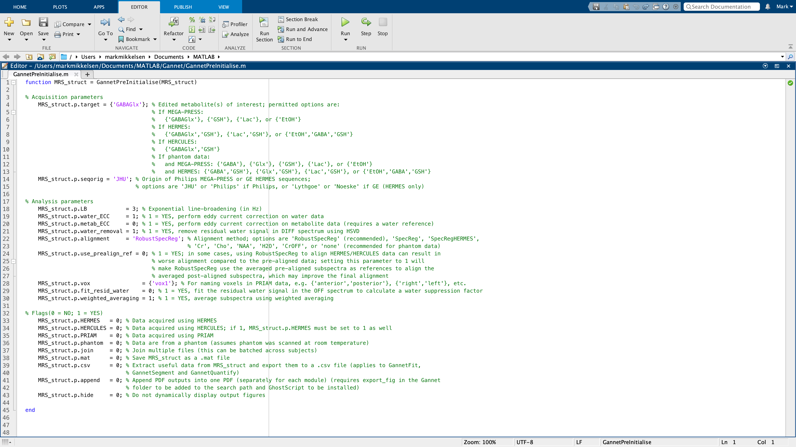

```{r setup, include = FALSE}
knitr::opts_chunk$set(echo = TRUE)
```

```{r, child = "js/back-to-top.js"}
```

<style>
body .main-container {
  max-width: 1200px;
}
</style>

<br>

Gannet simplifies the preprocessing and quantification pipeline of edited MRS data. All you need to get started is a basic understanding of the MATLAB environment and programming language and the five Gannet modules (listed below).

If this is your first time using Gannet, you will likely want to read through the [Reference](https://markmikkelsen.github.io/Gannet-docs/reference.html) as well. If you have previously worked with Gannet and only need a quick refresher about the command syntax, this page will probably be all you need to get started again.

## Modules

The linear workflow of Gannet is made up of five modules. For proper functionality, they need to be executed in the following order:

| <u>Module</u> | <u>Description</u> |
| :- | :--------- |
| **GannetLoad** | Loads raw data exported from the scanner; preprocesses them; plots the edited spectra; and gives information about the timecourse of the experiment. |
| **GannetFit** | Models the metabolite signals of interest in the difference spectra and the reference compounds; plots the data and the model fits; and gives basic quantification results and information about spectral quality. |
| **GannetCoRegister** | Loads the provided structural image data files; co-registers the loaded MRS voxel to them; and produces a figure showing the localization of the voxel on the structural image in three orthogonal slices. |
| **GannetSegment** | Calls SPM12 to segment the structural images; determines the fractional tissue composition (gray matter, white matter, and CSF) within the voxel; produces a figure showing the tissue fractions as overlays and displays CSF-corrected metabolite estimates. |
| **GannetQuantify** | Uses the segmentation information to perform partial volume tissue correction and produces a figure displaying several quantitative metabolite measures. |

Familiarize yourself with the five basic Gannet commands, as described below. The number of commands is deliberately kept to a minimum, as is the number of possible input arguments to these commands. Incorrect syntax is a common source of user error, so make sure that you understand the argument structure of each function you intend to use.

## Usage

### GannetPreInitialise

The first step in using Gannet is to set up the `GannetPreInitialise.m` function. While the toolkit has many built-in routines for automatically recognizing data formats, sequences, and acquisition parameters from data file headers; some settings may need to be set by the user before to run Gannet properly. All modifiable options and flags are collected in the file `GannetPreInitialise.m`.

<div class="info">
<i class="fa fa-exclamation-circle" style="color: white"></i>&nbsp;&nbsp; Any time you run Gannet, make sure to check that the settings in `GannetPreInitialise.m` are correct. Many errors can be avoided by following this simple step.
</div>

The default settings pre-initialize a standard analysis for in vivo GABA-edited MEGA-PRESS data. If you want to analyze data acquired with a different method or from a phantom, or target a different metabolite, you will need to make changes to this file. Please read the [Reference](https://markmikkelsen.github.io/Gannet-docs/reference.html) for detailed explanations of the options and flags in `GannetPreInitialise.m`.

<br>



<!-- <div id="myModal" class="modal"> -->
<!--   <span class="close">&times;</span> -->
<!--    -->
<!--   <div id="caption"></div> -->
<!-- </div> -->
<!-- <script src="js/img-modal.js"></script> -->

<br>

## Batch processing

One of the major strengths of Gannet is its ability to process datasets in batches using the same pipeline. In order to load a set of data, simply add more filenames to the respective cell arrays that are passed to `GannetLoad.m`, as exemplarily shown below for Siemens TWIX data:

```{matlab, eval = FALSE}
MRS_struct = GannetLoad({'S01_GABA_68_act.sdat', 'S02_GABA_68_act.sdat'}, ...
                        {'S01_GABA_68_ref.sdat', 'S02_GABA_68_ref.sdat'});
```

Note that the respective water-unsuppressed data files `S01_GABA_68_ref.sdat`, `S02_GABA_68_ref.sdat`, etc. need to be listed in the same order as the water-suppressed files `S01_GABA_68_act.sdat`, `S02_GABA_68_act.sdat`, etc. If you intend to process a large number of datasets, we recommend writing a separate script as a clear way of defining the input cell arrays. We have provided an [example script](https://markmikkelsen.github.io/Gannet-docs/batch-script.html) that you may modify for your own analyses.

## Output

As shown in the syntax above, Gannet saves all relevant data and results in the structure `MRS_struct` at all steps in the analysis pipeline. After creating the initial output from `GannetLoad.m`, `MRS_struct` is used as both the output and input arguments for the other Gannet modules. (You need not use `MRS_struct`; you can use something more descriptive and relevant to your purposes if you wish.)

The output structure contains several fields and subfields, which grow in number as your proceed through the Gannet analysis pipeline See the list of [output structure attributes](https://markmikkelsen.github.io/Gannet-docs/output-struc-attrib.html) for a complete description.

You can also output a CSV file containing useful values from the output structure for further analysis. This functionality is set in `GannetPreInitialise.m`.

<br>

<!-- <div style="text-align: right"> -->
<!--   <a class="fa fa-arrow-circle-right fa-2x" style="color: #2F3E4F" href="https://markmikkelsen.github.io/Gannet-docs/reference.html"></a> -->
<!-- </div> -->


