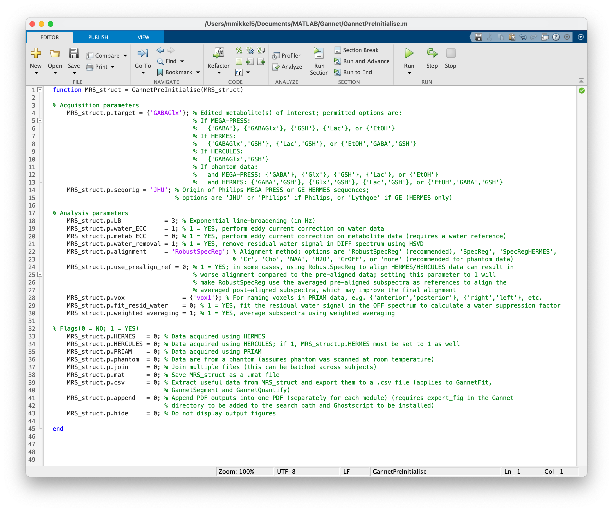

```{r setup, include = FALSE}
knitr::opts_chunk$set(echo = TRUE)
```

```{r, child = "js/back-to-top.js"}
```

<br>

Gannet simplifies the preprocessing, signal fitting, and quantification pipeline of edited MRS data. All you need to get started is a basic understanding of MATLAB and the five Gannet modules (listed below).

If this is your first time using Gannet, you should read through the [Reference](https://markmikkelsen.github.io/Gannet-docs/reference.html) as well. If you have previously worked with Gannet and only need a quick refresher about the command syntax, this page will probably be all you need to get started again.

## Modules

The linear workflow of Gannet is made up of five modules. For proper functionality, they need to be executed in the following order:

| <u>Module</u> | <u>Description</u> |
| :- | :--------- |
| **GannetLoad** | Loads raw data exported from the scanner; preprocesses them; plots the edited spectra; and gives information about the time course of the experiment. |
| **GannetFit** | Models the metabolite signals of interest in the difference spectra and the reference compounds; plots the data and the model fits; and gives basic quantification results and information about spectral quality. |
| **GannetCoRegister** | Loads the provided structural image data files; co-registers the loaded MRS voxel to them; and produces a figure showing the localization of the voxel on the structural image on three orthogonal slices. |
| **GannetSegment** | Calls SPM to segment the structural images; determines the fractional tissue composition (gray matter, white matter, and CSF) within the MRS voxel; produces a figure showing the tissue fractions as overlays and displays CSF-corrected metabolite estimates. |
| **GannetQuantify** | Uses the segmentation information to perform partial volume tissue correction and produces a figure displaying several tissue-corrected metabolite measurements. |

Familiarize yourself with the five basic Gannet commands, as described below. The number of commands is deliberately kept to a minimum, as is the number of possible input arguments to these commands. Incorrect syntax is a common source of user error, so make sure that you understand the argument structure of each function you intend to use.

## Usage

### GannetPreInitialise

The first step in using Gannet is to set up the `GannetPreInitialise.m` function. While the toolkit has many routines that automatically recognize data formats, sequences, and acquisition parameters from data file headers; some settings need to be set by the user to run Gannet properly. Additionally, `GannetPreInitialise.m` allows the user to choose how to process their data (for example, which frequency-and-phase correction algorithm to use).

::: warning
<i class="fa fa-exclamation-circle" style="color: white"></i>&nbsp; Any time you run Gannet, make sure to check that the settings in `GannetPreInitialise.m` are correct. Many errors can be avoided by following this simple step.
:::

The default settings pre-initialize a standard analysis for in vivo GABA-edited MEGA-PRESS data. If you want to analyze data acquired with a different method or from a phantom, or target a different metabolite, you will need to make changes to this file. Please read the [Reference](https://markmikkelsen.github.io/Gannet-docs/reference.html#pre-initializing-gannet) for detailed explanations of the options and flags in `GannetPreInitialise.m`.



### Loading and fitting data

Depending on the format of your data, and if you have water reference data and/or structural images, the commands for running Gannet to load and fit your data follow a specific syntax.

For all modules, an output argument containing a structure should always be included, for example `MRS_struct`. Input arguments for `GannetLoad.m` are usually given as cell arrays. Water-suppressed metabolite files must be given as the first input argument, while unsuppressed water reference files must be given as the second input argument. The remaining modules require input of the output structure from `GannetLoad.m`. (The exception is `GannetCoRegister.m`, which additionally requires a cell array of structural images.)

Some examples for different data file formats:

#### **DICOM data (\*.dcm files)**

The DICOM format saves each transient in a separate file, such that for an acquisition with 320 transients, there will be 320 DICOM files. Data from each acquisition should be stored in an individual directory. To run such data, use the following commands:

```{octave, eval = FALSE}
MRS_struct = GannetLoad({'metab/file1.dcm'}, {'water/file1.dcm'});
MRS_struct = GannetFit(MRS_struct);
```

::: info
<i class="fa fa-info-circle" style="color: white"></i>&nbsp; Note how the metabolite and water data are stored in separate directories and that a single DICOM file is selected for data loading (it does not matter which file in each directory is chosen).
:::

#### **GE data (\*.7 files)**

Data from GE scanners are exported as a P-file, with the extension \*.7. Standard GE acquisitions automatically acquire a water reference, which is stored within the P-file. To run such data, use the following commands:

```{octave, eval = FALSE}
MRS_struct = GannetLoad({'sub-01.7'});
MRS_struct = GannetFit(MRS_struct);
```

#### **NIfTI data (\*.nii[.gz] files)**

<a href="https://doi.org/10.1002/mrm.29418" target="_blank">NIfTI-MRS</a> was developed to serve as an open-source data format standard for MRS. Both compressed and uncompressed files can be processed in Gannet. To run such data, use the following commands:

```{octave, eval = FALSE}
MRS_struct = GannetLoad({'sub-01.nii'}, {'sub-01_ref.nii'});
MRS_struct = GannetFit(MRS_struct);
```

#### **Philips data (\*.sdat/\*.spar files)**

Data from Philips scanners are most commonly exported as a pair of \*.sdat/\*.spar files, where the \*.sdat file contains the data and the \*.spar contains the acquisition parameters. A water reference usually is also acquired and exported as a separate pair of files. The two are distinguished by the suffices `_act` and `_ref`. To run such data, use the following commands:

```{octave, eval = FALSE}
MRS_struct = GannetLoad({'sub-01_act.sdat'}, {'sub-01_ref.sdat'});
MRS_struct = GannetFit(MRS_struct);
```

::: info
<i class="fa fa-info-circle" style="color: white"></i>&nbsp; The \*.spar files must be in the same directory as the \*.sdat files, otherwise an error will occur.
:::

#### **Siemens data (\*.dat files)**

It is highly recommended that users export data in the TWIX format for Siemens data. This is a raw format that saves the MRS signal for each transient from each RF coil element separately. To run such data, use the following commands:

```{octave, eval = FALSE}
MRS_struct = GannetLoad({'sub-01.dat'}, {'sub-01_water.dat'});
MRS_struct = GannetFit(MRS_struct);
```

#### **Siemens data (\*.ima files)**

The Siemens DICOM-structured IMA format saves each transient in a separate file, such that for an acquisition with 320 transients, there will be 320 IMA files. Data from each acquisition should be stored in an individual directory. To run such data, use the following commands:

```{octave, eval = FALSE}
MRS_struct = GannetLoad({'metab/file1.ima'}, {'water/file1.ima'});
MRS_struct = GannetFit(MRS_struct);
```

::: info
<i class="fa fa-info-circle" style="color: white"></i>&nbsp; Note how the metabolite and water data are stored in separate directories and that a single IMA file is selected for data loading (it does not matter which file in each directory is chosen).
:::

#### **Siemens data (\*.rda files)**

The Siemens RDA format for edited MRS data usually sums the edit-ON and edit-OFF transients and exports them as single files. A third file with the resulting difference spectrum may also be exported. This format is not recommended for use in Gannet as a number of important preprocessing steps cannot be run. However, to run such data, use the following commands:

```{octave, eval = FALSE}
MRS_struct = GannetLoad({'OFF.rda', 'ON.rda'});
MRS_struct = GannetFit(MRS_struct);
```

::: info
<i class="fa fa-info-circle" style="color: white"></i>&nbsp; Take note that the edit-OFF file must be input first.
:::

### Co-registration to an MR image

After MRS data files are loaded and fitted, and if an anatomical MR image was acquired and used to place MRS voxels, Gannet can co-register the two. To do so, use the following command: 

```{octave, eval = FALSE}
MRS_struct = GannetCoRegister(MRS_struct, {'T1w.nii'});
```

### Segmenting MR images

Gannet uses SPM12's segmentation routine to segment anatomical MR images. The grey matter, white matter, and cerebrospinal fluid fractions are then used in subsequent tissue corrections of metabolite concentration estimates.

Installation instructions for SPM12 can be found [here](https://markmikkelsen.github.io/Gannet-docs/index.html#installation).

Run segmentation using the following command:

```{octave, eval = FALSE}
MRS_struct = GannetSegment(MRS_struct);
```

### Quantification

Following tissue segmentation, and assuming a water reference was inputted at data loading, pseudo-absolute quantification can be performed using the following command:

```{octave, eval = FALSE}
MRS_struct = GannetQuantify(MRS_struct);
```

## Batch processing

One of the major strengths of Gannet is its ability to process datasets in batches using the same pipeline. To load and fit multiple files, simply add more filenames to the respective cell arrays that are passed to `GannetLoad.m`, as shown below for Philips data:

```{octave, eval = FALSE}
MRS_struct = GannetLoad({'sub-01_act.sdat', 'sub-02_act.sdat', 'sub-03_act.sdat'}, ...
                        {'sub-01_ref.sdat', 'sub-02_ref.sdat', 'sub-03_ref.sdat'});
MRS_struct = GannetFit(MRS_struct);
# Only if anatomical MR images are available, the next lines can be run
# Note that the number of anatomical images must match the number of MRS metabolite data files inputted
MRS_struct = GannetCoRegister(MRS_struct, {'T1w.nii', 'T1w.nii', 'T1w.nii'});
MRS_struct = GannetSegment(MRS_struct);
MRS_struct = GannetQuantify(MRS_struct);
```

The respective water reference files `sub-01_ref.sdat`, `sub-02_ref.sdat`, etc. need to be listed in the same order as the water-suppressed files `sub-01_act.sdat`, `sub-01_act.sdat`, etc. If you intend to process a large number of datasets, we recommend writing a script as a clear way of defining the input cell arrays.

We have provided an [example batch processing script](https://markmikkelsen.github.io/Gannet-docs/batch-script.html) that you may modify for your own purposes.

## Joining data files

In some instances users may want to conjoin consecutively acquired data files, such that they are processed as if they were one single dataset. Gannet is able to do this. To enable this functionality, the `join` flag in `GannetPreInitialise.m` must be set to `1`.

However, there is a different command syntax when batch-processing across multiple subjects' datasets In such cases, rather than entering files as vectors, the input cell arrays must be M $\times$ N matrices, where M is the number of files per subject to be conjoined and N is the number of subjects.

We have provided an [example script](https://markmikkelsen.github.io/Gannet-docs/joining-data-files.html) for joining files.

## Output

As shown in the syntax above, Gannet saves all relevant data and results in a structure (e.g., `MRS_struct`) at all steps in the analysis pipeline. After creating the initial output from `GannetLoad.m`, `MRS_struct` is used as both the output and input arguments for the other Gannet modules. (You need not use `MRS_struct`; you can use something more descriptive and relevant to your purposes if you wish.)

The output structure contains several fields and subfields, which grow in number as your proceed through the Gannet analysis pipeline. See the list of [output structure attributes](https://markmikkelsen.github.io/Gannet-docs/output-structure-attributes.html) for a complete description.

You can also output a CSV file containing useful values from the output structure for further analysis in a statistical program of your choice. This functionality is set in `GannetPreInitialise.m`.


