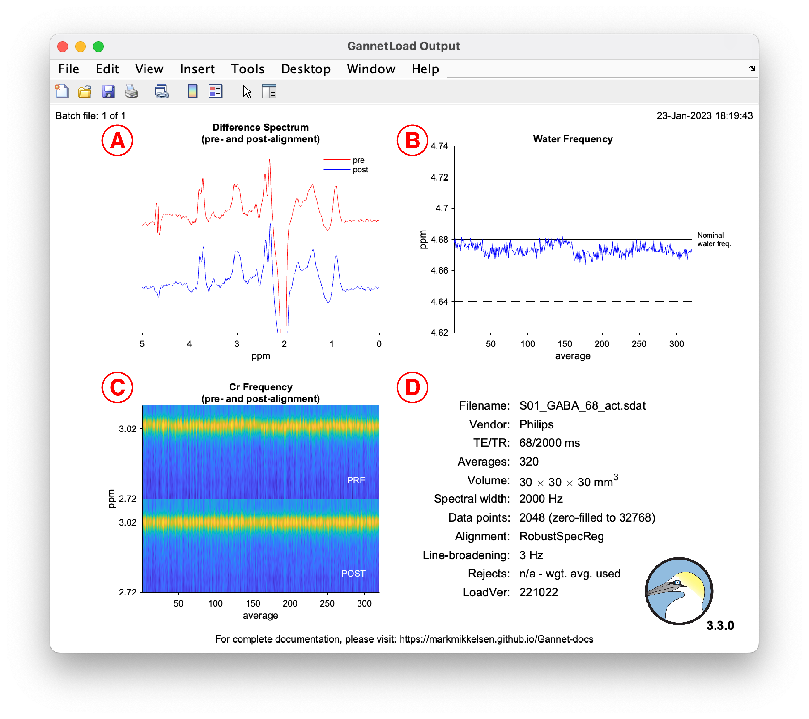

```{r setup, include = FALSE}
knitr::opts_chunk$set(echo = TRUE)
```

```{r, child = "js/back-to-top.js"}
```

<br>

::: info
<i class="fa fa-info-circle" style="color: white"></i>&nbsp; The variables listed on this page are applicable to release 3.3.0 and are not necessarily correct for other versions of Gannet.
:::

## Pre-initialize Gannet

------------------------------------------------------------------------

**Parent function**

`GannetPreInitialise.m`

<br>

| <u>Acquisition parameters</u> | <u>Description</u> |
|:------------------|:----------------------------------------------------|
| `target` | Sets the metabolite of interest that was edited in the MRS experiment; if HERMES or HERCULES was used, multiple metabolites should be selected |
| `seqorig` | Origin of the Philips MEGA-PRESS or GE HERMES sequences |

| <u>Analysis parameters</u> | <u>Description</u> |
|:------------------|:----------------------------------------------------|
| `LB` | Sets the amount of exponential line-broadening to apply to the data (in Hz)                                           |
| `water_ECC` | Whether to perform an eddy-current correction [@Klose1990] on the water data                                          |
| `metab_ECC` | Whether to perform an eddy-current correction on the metabolite data                                                  |
| `water_removal` | Whether to remove the residual water signal from the difference spectra using an HSVD filter [@Barkhuijsen1987]       |
| `alignment` | Which method to use for shot-to-shot frequency-and-phase correction [@Evans2013; @Near2015; @Mikkelsen2018; @Mikkelsen2020] |
| `use_prealign_ref` | In some cases, using `RobustSpecReg` to align HERMES/HERCULES data can result in worse alignment compared to the pre-aligned data; setting this parameter to 1 will make `RobustSpecReg` use the averaged pre-aligned subspectra as references to align the averaged post-aligned subspectra, which may improve the final alignment; this has not be tested extensively |
| `fit_resid_water` | Whether to model the residual water signal in the difference spectrum; used to calculate a water suppression factor |
| `weighted_averaging` | Whether to average the data using weighted averaging; the default approach use is mean-squared error, but other approaches can be set in `SignalAveraging.m` |

| <u>Flags</u> | <u>Description</u> |
|:------------------|:----------------------------------------------------|
| `HERMES`   | Set to `1` if the data were acquired using HERMES                                                                                         |
| `HERCULES` | Set to `1` if the data were acquired using HERCULES (`HERMES` must also be set to `1`)                                                    |
| `PRIAM`    | Set to `1` if the data were acquired using PRIAM                                                                                          |
| `phantom`  | Set to `1` if the data were acquired in a phantom                                                                                         |
| `join`     | Set to `1` to join multiple files (this can be batched across subjects)                                                                   |
| `mat`      | Set to `1` to save the output structure as a MAT-file                                                                                     |
| `csv`      | Set to `1` to export a CSV file containing useful data for analysis (applies to `GannetFit.m`, `GannetSegment.m` and `GannetQuantify.m`) |
| `append`   | Set to `1` to append PDF outputs into one PDF (separately for each module) (requires `export_fig` in the `Gannet/` directory to be added to the search path and <a href="https://www.ghostscript.com/" target="_blank">Ghostscript</a> to be installed (NB: macOS users should use <a href="https://pages.uoregon.edu/koch/" target="_blank">this version</a> or use <a href="https://formulae.brew.sh/formula/ghostscript" target="_blank">Homebrew</a> to install Ghostscript) |
| `hide`     | Set to `1` to not display output figures |

<br>

## Loading and preprocessing data

------------------------------------------------------------------------

**Parent function**

`GannetLoad.m`

<br>

**Example usage:**

```{octave, eval = FALSE}
MRS_struct = GannetLoad({'S01_GABA_68_act.sdat'}, {'S01_GABA_68_ref.sdat'});
```

Output:



## Signal fitting

------------------------------------------------------------------------

**Parent function**

`GannetFit.m`

<br>

**Example usage:**

```{octave, eval = FALSE}
MRS_struct = GannetLoad({'S01_GABA_68_act.sdat'}, {'S01_GABA_68_ref.sdat'});
MRS_struct = GannetFit(MRS_struct);
```

Output:


## Voxel co-registration

------------------------------------------------------------------------

**Parent function**

`GannetCoRegister.m`

<br>

**Example usage:**

```{octave, eval = FALSE}
MRS_struct = GannetLoad({'S01_GABA_68_act.sdat'}, {'S01_GABA_68_ref.sdat'});
MRS_struct = GannetFit(MRS_struct);
MRS_struct = GannetCoRegister(MRS_struct, {'S01_struc.nii'});
```

Output:


## Tissue segmentation

------------------------------------------------------------------------

**Parent function**

`GannetSegment.m`

<br>

**Example usage:**

```{octave, eval = FALSE}
MRS_struct = GannetLoad({'S01_GABA_68_act.sdat'}, {'S01_GABA_68_ref.sdat'});
MRS_struct = GannetFit(MRS_struct);
MRS_struct = GannetCoRegister(MRS_struct, {'S01_struc.nii'});
MRS_struct = GannetSegment(MRS_struct);
```

Output:


## Quantification

------------------------------------------------------------------------

**Parent function**

`GannetQuantify.m`

<br>

**Example usage:**

```{octave, eval = FALSE}
MRS_struct = GannetLoad({'S01_GABA_68_act.sdat'}, {'S01_GABA_68_ref.sdat'});
MRS_struct = GannetFit(MRS_struct);
MRS_struct = GannetCoRegister(MRS_struct, {'S01_struc.nii'});
MRS_struct = GannetSegment(MRS_struct);
MRS_struct = GannetQuantify(MRS_struct);
```

Output:


### References


