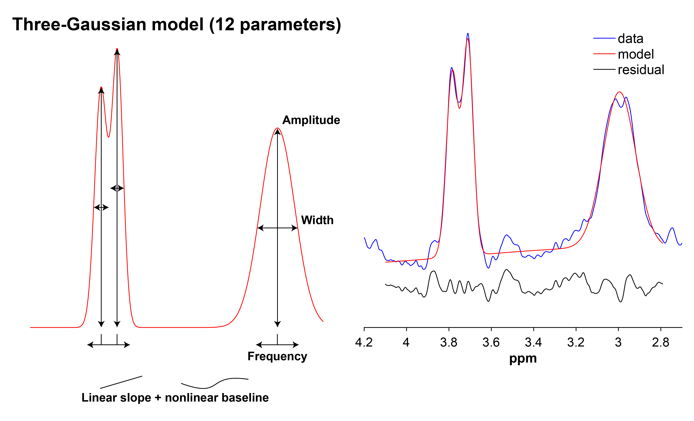
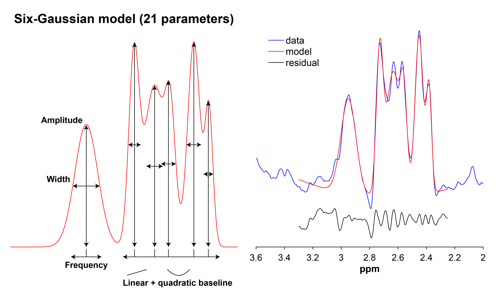
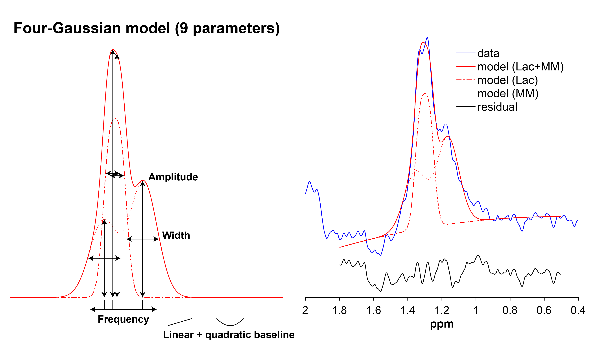
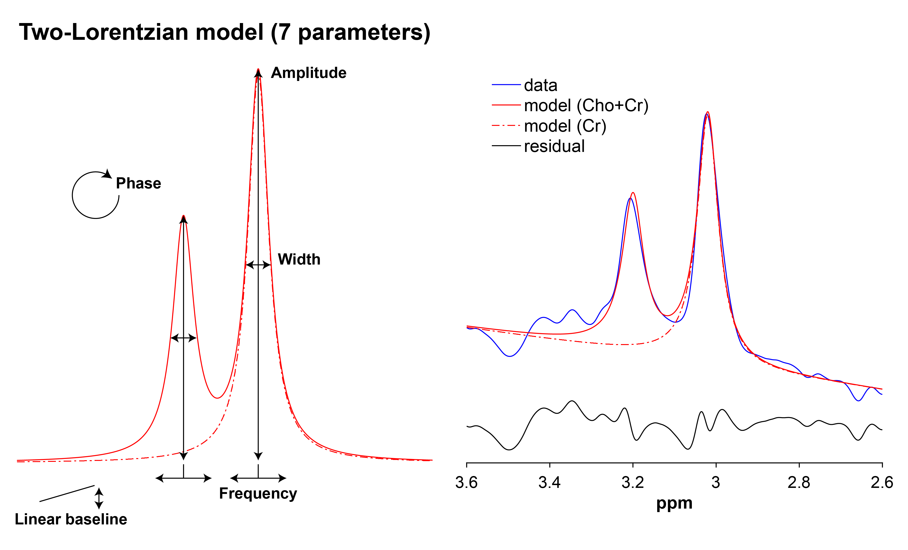
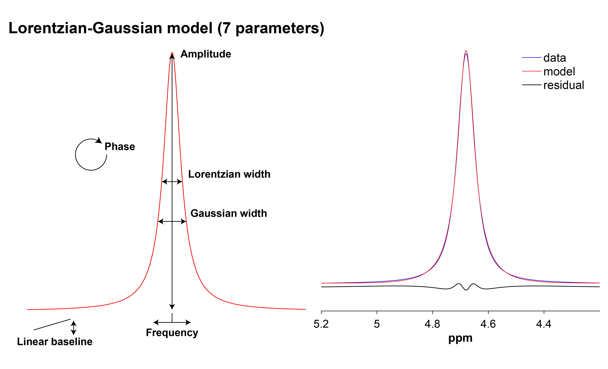

```{r setup, include = FALSE}
knitr::opts_chunk$set(echo = TRUE)
```

```{r, child = "js/back-to-top.js"}
```

```{css, echo = FALSE}
table {
  margin: auto;
}

table thead th {
  border-bottom: 1px solid #ddd;
}

th, td {
  padding: 5px;
}

tfoot, tr:nth-child(even) {
  background: #eee;
}
```

<br>

This page describes the functions Gannet uses to model metabolite signals. Note that when the definition of a parameter is omitted from a table under a particular metabolite, it is implied that it has been defined already in a previously described function.

For all model fitting, Gannet uses nonlinear regression, with fit parameters optimized using the least-squares Levenberg-Marquardt algorithm. For increased computational speed and a better solution, the starting values of the optimization are derived from a "pre-fit" that uses the trust-region-reflective algorithm. Description of these algorithms can be found in the <a href="https://www.mathworks.com/help/optim/ug/least-squares-model-fitting-algorithms.html" target="_blank">online MATLAB documentation</a>.

## GABA+Glx

GABA and Glx are fitted using a three-Gaussian model with a linear slope and non-linear baseline:

$$
S(f) =
\sum_{i=1}^{3}\left\{A_i\exp[\sigma_i(f-f_i)^2]\right\}+
m(f-f_1)+
b_1\sin(\pi{f}/1.31/4)+
b_2\cos(\pi{f}/1.31/4)
$$

where:

| <u>Parameter</u> | <u>Definition</u> |
| :- | :-------- |
| $f$ | Frequency (ppm) |
| $A_i$ | Gaussian *i*'s amplitude |
| $\sigma_i$ | Gaussian *i*'s width |
| $f_i$ | Gaussian *i*'s center frequency (ppm) |
| $m$ | Slope of linear baseline |
| $b_1$ | Sine baseline term |
| $b_2$ | Cosine baseline term |

::: info
<i class="fa fa-info-circle" style="color: white"></i>&nbsp; The GABA+Glx model is fitted using a model that has observation weights between 3.16 and 3.285 ppm, where the Cho subtraction artifact [@Evans2013] appears. The purpose is to down-weight the influence of this artifact (if present) on the model fitting.
:::



## GSH (TE < 100 ms)

GSH that is edited at a TE < 100 ms is fitted with a five-Gaussian model with a linear + quadratic baseline:

$$
S(f) =
\sum_{i=1}^{5}\left\{A_i\exp[\sigma_i(f-f_i)^2]\right\}+
m_1(f-f_1)+
m_2(f-f_1)^2+b
$$

where:

| <u>Parameter</u> | <u>Definition</u> |
| :- | :-------- |
| $m_1$ | Slope of linear baseline |
| $m_2$ | Quadratic baseline term |
| $b$ | Baseline offset |


## GSH (TE >= 100 ms)

GSH that is edited at a TE >= 100 ms is fitted with a six-Gaussian model with a linear + quadratic baseline:

$$
S(f) =
\sum_{i=1}^{6}\left\{A_i\exp[\sigma_i(f-f_i)^2]\right\}+
m_1(f-f_1)+
m_2(f-f_1)^2+b
$$



## Lac

::: info
<i class="fa fa-info-circle" style="color: white"></i> Optimization of the modeling of edited Lac is ongoing.
:::

Lac is fitted with a four-Gaussian model with a linear + quadratic baseline:

$$
S(f) =
\sum_{i=1}^{4}\left\{A_i\exp[\sigma_i(f-f_i)^2]\right\}+
m_1(f-f_1)+
m_2(f-f_1)^2+b
$$



## EtOH

EtOH is fitted with a two-Lorentzian model with a linear baseline:

$$
S(f) =
\sum_{i=1}^{2}\left[\frac{A_{i}}{1+\left(\frac{f-f_{i}}{\gamma_{i}/2}\right)^2}\right]+
m(f-f_1)+b
$$

where:

| <u>Parameter</u> | <u>Definition</u> |
| :- | :-------- |
| $A_i$ | Lorentzian *i*'s amplitude |
| $f_i$ | Lorentzian *i*'s center frequency (ppm) |
| $\gamma$ | Lorentzian width (full-width at half-maximum) |

::: info
<i class="fa fa-info-circle" style="color: white"></i>&nbsp; The EtOH model is fitted using a model that has observation weights between 1.29 and 1.51 ppm, where the Lac subtraction artifact appears. The purpose is to down-weight the influence of this artifact (if present) on the model fitting.
:::

## Cho+Cr

Cho and Cr in the edit-OFF spectrum are fitted with a two-Lorentzian model with a linear baseline:

$$
Absorption(f) =
\frac{A}{2\pi}\frac{\gamma}{(f-f_0)^2+\gamma^2}+
\frac{Ah}{2\pi}\frac{\gamma}{(f-f_0-0.18)^2+\gamma^2}
$$
$$
Dispersion(f) =
\frac{A}{2\pi}\frac{f-f_0}{(f-f_0)^2+\gamma^2}+
\frac{Ah}{2\pi}\frac{f-f_0-0.18}{(f-f_0-0.18)^2+\gamma^2}
$$

$$
S(f) =
\cos(\phi)Absorption(f)+
\sin(\phi)Dispersion(f)+
m(f-f_0)+b
$$

where:

| <u>Parameter</u> | <u>Definition</u> |
| :- | :-------- |
| $A$ | Amplitude of Cr peak |
| $\gamma$ | Lorentzian width (half-width at half-maximum) |
| $f_0$ | Center frequency of Cr peak |
| $h$ | Amplitude scaling factor for Cho peak |
| $\phi$ | Phase |



## NAA

NAA in the edit-OFF spectrum is fitted with a Lorentzian model with a linear baseline:

$$
Absorption(f) =
\frac{A}{2\pi}\frac{\gamma}{(f-f_0)^2+\gamma^2}
$$
$$
Dispersion(f) =
\frac{A}{2\pi}\frac{(f-f_0)}{(f-f_0)^2+\gamma^2}
$$

$$
S(f) =
\cos(\phi)Absorption(f)+
\sin(\phi)Dispersion(f)+
m(f-f_0)+b
$$

## Water

The unsurpressed water signal is fitted with a Lorentzian-Gaussian model with a linear baseline:

$$
S(f) = 
\frac{\cos(\phi)A+\sin(\phi)A\gamma(f-f_0)}
{\gamma^2(f-f_0)^2+1}
\exp[\sigma(f-f_0)^2]+
m(f-f_0)+b
$$



<br>

### References


